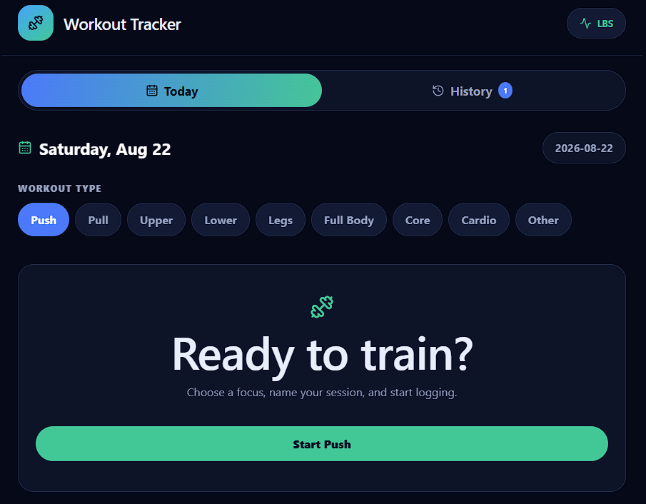
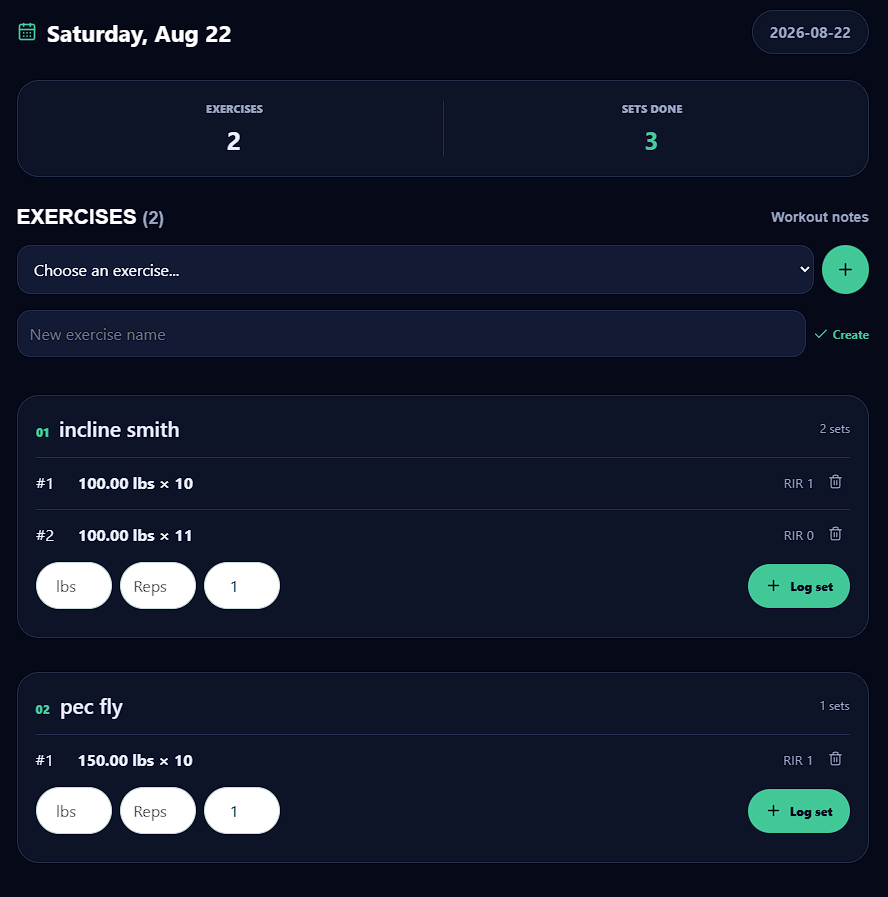
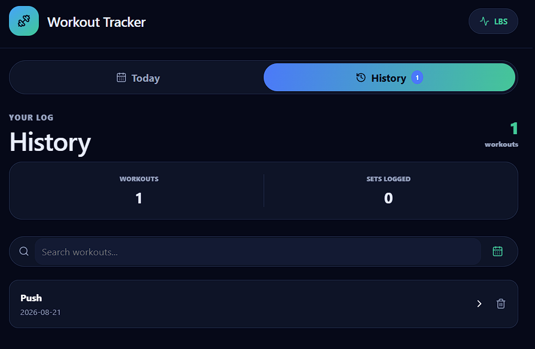

# Workout Tracker

Workout Tracker is a private, self-hosted workout logging app. It lets you create workouts, add exercises, record sets, review workout history, search by name or date, and browse logged workouts on a calendar.

The app runs as three Docker services:

- **Frontend:** React, Vite, and Nginx
- **API:** FastAPI and Python
- **Database:** PostgreSQL

## Features

- Create workouts by training focus or custom name
- Add existing or new exercises to a workout
- Log weight, reps, and RIR for each set
- Delete individual sets or complete workouts
- Search history by workout name or date
- Browse workout history by month in a calendar
- Show workout names on calendar days with logged workouts
- Protect the app with HTTP Basic Authentication

## Screenshots

### Today

Choose a workout focus and start a new session from the Today view.



### Logging a Workout

Add exercises and record weight, reps, and RIR for each set.



### History

Search workouts by name or date and review past sessions.



## Run Locally

Requirements:

- Docker Desktop
- Docker Compose

Create the local environment file from the example:

```powershell
Copy-Item .env.example .env
```

Edit `.env` and replace every placeholder with local values. Then start the stack from the repository root:

```powershell
docker compose up --build -d
```

Open the app at:

```text
http://127.0.0.1:5173
```

The frontend will prompt for the `APP_USERNAME` and `APP_PASSWORD` values from `.env`.

View running services:

```powershell
docker compose ps
```

Stop the stack:

```powershell
docker compose down
```

## Private Phone Access

The recommended remote-access setup is Tailscale with Tailscale Serve. The frontend should remain bound to `127.0.0.1`; do not expose PostgreSQL or the API directly and do not use Tailscale Funnel.

On the desktop, after installing and signing into Tailscale:

```powershell
& "C:\Program Files\Tailscale\tailscale.exe" serve --bg http://127.0.0.1:5173
& "C:\Program Files\Tailscale\tailscale.exe" serve status
```

Open the HTTPS address reported by `serve status` on a phone that is signed into the same Tailscale account. The address should show `tailnet only`.

## Database Migrations

Migrations run automatically when the API container starts. To run them manually:

```powershell
docker compose exec api python scripts/run_migrations.py
```

The migration files are in `backend/migrations/` and are applied once in filename order.

To inspect the development database:

```powershell
docker exec -it workout_postgres psql -U postgres -d workout_db
```

Do not drop tables unless you intend to erase the workout data. PostgreSQL data is stored in the `postgres_data` Docker volume.

## API Routes

The frontend reaches these routes through the `/api` prefix. For example, `GET /api/workouts` is proxied to the API's `GET /workouts` route.

### Workouts

```text
GET    /workouts
GET    /workouts/{workout_id}
POST   /workouts
PUT    /workouts/{workout_id}
DELETE /workouts/{workout_id}
```

### Exercises

```text
GET    /exercises
POST   /exercises
PUT    /exercises/{exercise_id}
DELETE /exercises/{exercise_id}
```

### Sets

```text
GET    /sets/workout-exercises/{workout_exercise_id}
POST   /sets/workout-exercises/{workout_exercise_id}
GET    /sets/{set_id}
PATCH  /sets/{set_id}
DELETE /sets/{set_id}
```

### Workout Exercises

These routes manage the relationship between workouts and exercises.

```text
GET    /workouts/{workout_id}/exercises
GET    /workouts/{workout_id}/exercises/{exercise_id}
POST   /workouts/{workout_id}/exercises
PATCH  /workouts/{workout_id}/exercises/{exercise_id}
DELETE /workouts/{workout_id}/exercises/{exercise_id}
```

## Repository Security

- Never commit `.env`, database dumps, credentials, tokens, certificates, or private keys.
- Commit `.env.example` only, with placeholder values.
- Use strong, unique local passwords for the app and database.
- Keep the app bound to `127.0.0.1` when using Tailscale Serve.
- Keep Tailscale access limited to trusted devices and enable multi-factor authentication.
- Do not configure router port forwarding or Tailscale Funnel.

### Happy Lifting :)
